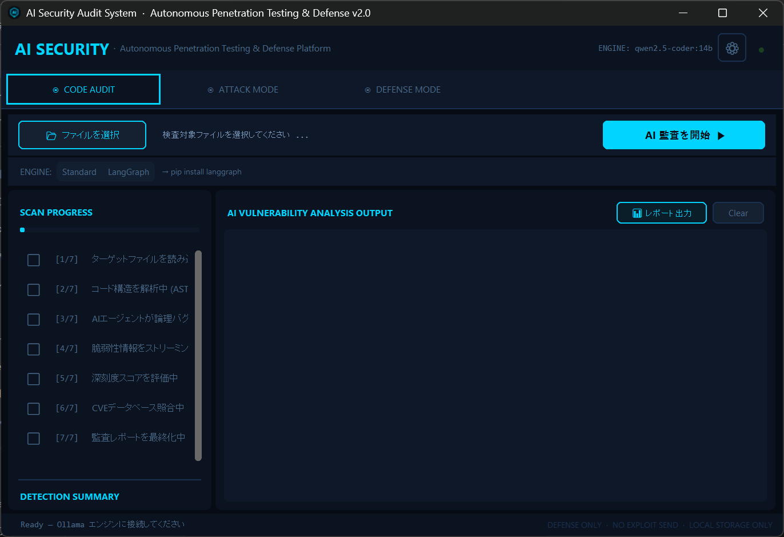
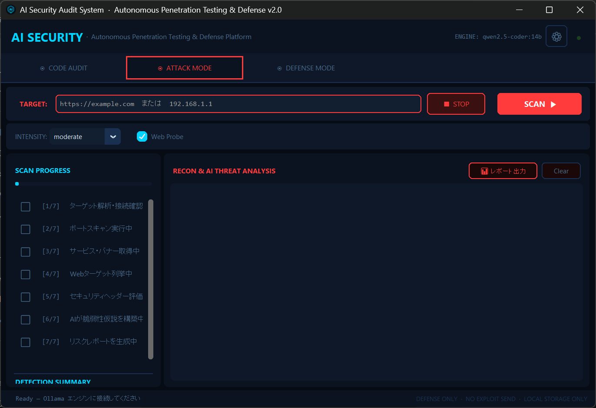
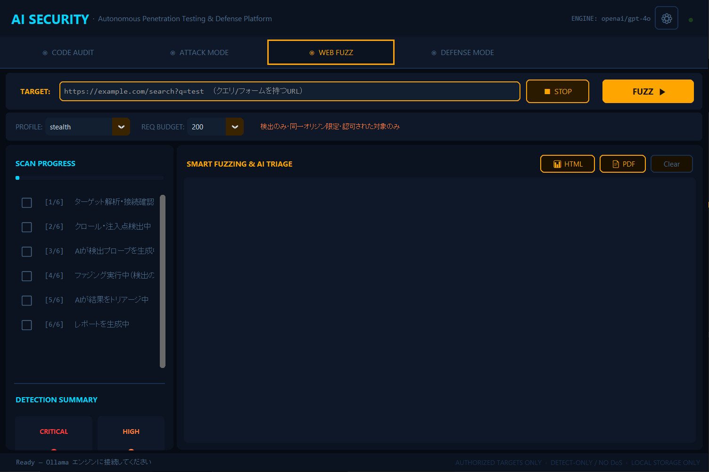
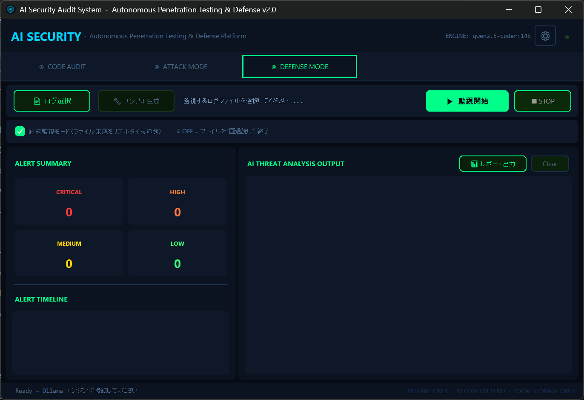

# AI Security Audit System
**Autonomous Penetration Testing & Defense Platform v2.3**

> シグネチャ（既知パターン）に依存しない、AI駆動型・次世代自律ペネトレーションテスト＆脆弱性露出管理システム


---

## 概要

本ツールは、セキュリティ専門家・研究者向けの **AI自律エージェントによるセキュリティ診断プラットフォーム**です。  
既知のCVEやシグネチャへの依存をなくし、大規模言語モデル（LLM）による **文脈理解・推論・異常検知** を組み合わせることで、従来ツールでは発見困難な**未知の脆弱性・設計上の論理的欠陥**を自律的に探索します。

### 4つの動作モード

| モード | 概要 | ターゲット |
|--------|------|-----------|
| **CODE AUDIT** | Pythonコードをセマンティック解析し、SQLi・IDOR・競合状態など設計上の脆弱性を発見 | `.py` ソースファイル |
| **ATTACK MODE** | ターゲットに対してAIが自律的にポートスキャン・HTTP探査・攻撃仮説生成を実施（許可されたターゲットのみ） | Webサービス・サーバー |
| **WEB FUZZ** | Webアプリをクロールして注入点を抽出し、AIが生成した検出プローブで脆弱性の兆候（SQLi・XSS・トラバーサル・SSTI）を観測（検出のみ・非エクスプロイト） | Webアプリケーション |
| **DEFENSE MODE** | ログファイルをリアルタイム監視し、攻撃パターンをMITRE ATT&CK準拠でAI分類・即時アラート | アクセスログ |

---

## スクリーンショット

### CODE AUDIT — セマンティック脆弱性解析

AIがコードの文脈を読み取り、CVEに存在しない論理的欠陥（タイミング攻撃・競合状態・認可不備など）を炙り出す。



### ATTACK MODE — 自律ペネトレーションテスト

ポートスキャン → サービス特定 → 受動OS推定 → Web探査 → LLMによる攻撃仮説生成まで、AIエージェントが自律的に実行。  
**スキャンプロファイル**（`stealth` / `passive` / `moderate` / `aggressive`）でフットプリント（検知されやすさ）と速度を切り替え可能。`stealth` はポート走査順のランダム化・接続ごとのジッター・実在ブラウザUAローテーション・低並列により、IDS/レート検知に引っかかりにくい静かな探査を行う。  
**必ず許可されたターゲットに対してのみ使用すること。**



### WEB FUZZ — スマートファジング（検出のみ）

Webアプリを浅くクロールしてクエリ・フォームの注入点を抽出 → AIが各脆弱性クラスの**検出プローブ**を文脈推論で生成 → レスポンスの異常（未エスケープ反射・DBエラー署名・テンプレート評価・既知ファイル署名）を観測して脆弱性の兆候を報告。  
**検出のみ・非エクスプロイト**設計で、総リクエスト数に上限を設けDoSを回避。ステルスプロファイルのジッター／低並列を流用し、同一オリジン限定で動作する。  
**必ず許可されたターゲットに対してのみ使用すること。**



### DEFENSE MODE — リアルタイム脅威監視

ログをリアルタイムで追跡し、攻撃パターン（SQLi・XSS・コマンドインジェクション等）を即時検知。  
AIが攻撃者のTTP（戦術・技術・手順）をMITRE ATT&CKフレームワークで分類し、防御アクションを提示。



---

## アーキテクチャ

```
AI-Security-tool/
├── main.py                    # エントリポイント（スプラッシュ→遅延ロード→App起動）
├── config.json                # LLM接続設定（gitignore済み・APIキー含む可能性あり）
├── requirements.txt           # 依存ライブラリ一覧
├── Dockerfile                 # Dockerコンテナ定義
├── docker-compose.yml         # Docker Compose設定
├── 起動.bat                   # Windowsランチャー（コンソールあり）
├── 起動_silent.bat            # Windowsランチャー（コンソールなし）
├── 起動.sh                    # Linuxランチャー
├── 起動.command               # macOSランチャー（Finderダブルクリック対応）
├── core/
│   ├── settings.py            # 全設定・カラーテーマ定数
│   ├── config.py              # config.jsonの読み書き（settings.pyをデフォルトとしてフォールバック）
│   ├── event_bus.py           # スレッドセーフUIイベントバス（Queue-based）
│   ├── llm_client.py          # OpenAI互換LLMクライアント（Ollama/OpenAI/OpenRouter・ホットリロード対応）
│   └── orchestrator.py        # LangGraph StateGraph（条件付き深層解析ループ）
├── agents/
│   ├── base_agent.py          # エージェント抽象基底クラス（threading.Event管理）
│   ├── audit_agent.py         # CODE AUDIT エージェント（CVE照合付き）
│   ├── langgraph_audit_agent.py # LangGraph強化型監査エージェント
│   ├── recon_agent.py         # ATTACK MODE エージェント（偵察・仮説生成）
│   ├── fuzz_agent.py          # WEB FUZZ エージェント（クロール→AIプローブ→検出→トリアージ）
│   └── monitor_agent.py       # DEFENSE MODE エージェント（ログ監視・脅威分析）
├── tools/
│   ├── network_scanner.py     # Socket-basedポートスキャナ（nmap不要）
│   ├── web_prober.py          # HTTP探査・技術スタック指紋採取
│   ├── web_fuzzer.py          # Webスマートファザー（クロール・注入点検出・異常観測／検出のみ）
│   ├── log_watcher.py         # tailf式リアルタイムログ追跡（標準ライブラリのみ）
│   ├── cve_client.py          # NVD API v2クライアント（CWE→CVE照合・キャッシュ付き）
│   ├── report_generator.py    # HTML/PDFレポート生成（ダークテーマ・脆弱性詳細付き）
│   ├── pdf_writer.py          # 日本語対応PDFレンダラー（Pillowのみ・依存追加なし）
│   ├── create_shortcut.py     # デスクトップショートカット生成（Windows）
│   ├── run_selftest.py        # 全機能セルフテスト（GUI以外を網羅）
│   └── capture_screenshots.py # README用スクリーンショット自動撮影
├── gui/
│   ├── app.py                 # メインウィンドウ（4タブ、DPI対応、⚙設定ボタン）
│   ├── splash.py              # 起動スプラッシュスクリーン（tkinter製・高速表示）
│   ├── export_util.py         # レポート出力（HTML/PDF）共通ヘルパー
│   ├── dialogs/
│   │   └── settings_dialog.py # LLM接続設定ダイアログ（接続テスト・設定保存）
│   ├── widgets/
│   │   ├── output_box.py      # カラータグ付きAI出力ボックス
│   │   └── progress_steps.py  # ステップ進捗ウィジェット（DETECTION SUMMARY付き）
│   └── panels/
│       ├── audit_panel.py     # CODE AUDIT タブ（LangGraphトグル・レポート出力）
│       ├── attack_panel.py    # ATTACK MODE タブ（レポート出力）
│       ├── fuzz_panel.py      # WEB FUZZ タブ（プロファイル・REQ予算・レポート出力）
│       └── defense_panel.py   # DEFENSE MODE タブ（レポート出力）
├── assets/
│   ├── create_icon.py         # アプリアイコン生成スクリプト（PIL）
│   ├── icon.ico / icon.png    # 生成済みアプリアイコン
├── samples/
│   └── target_code.py         # CODE AUDIT 動作確認用のサンプル脆弱コード
├── docs/                      # 設計書・スクリーンショット
└── reports/                   # スキャン結果出力先（ローカル保存のみ）
```

### 設計上の重要な決定

- **EventBus パターン**: エージェント（バックグラウンドスレッド）とGUI（メインスレッド）を完全に分離。  
  `queue.Queue` を使いスレッドセーフなメッセージパッシングを実現し、tkinterのスレッド制約を回避。
- **BaseAgent抽象クラス**: `threading.Event` による停止シグナリング。全エージェントが `is_stopped()` で中断できる。
- **DPI-aware ウィンドウ**: `GetDpiForWindow()` でWindowsの150%スケーリング環境に完全対応。
- **ストリーミングLLM出力**: 各AIチャンクをEventBus経由でリアルタイムにGUIへ流す。
- **設定の永続化**: `config.json` にLLM接続設定を保存。APIキーを含む可能性があるためgitから除外。

---

## 技術スタック

| 分類 | 技術 |
|------|------|
| 言語 | Python 3.10 以上 |
| GUIフレームワーク | CustomTkinter 5.2.2（ダークモード） |
| LLMバックエンド | Ollama + `qwen2.5-coder:14b`（デフォルト）/ OpenAI / OpenRouter（OpenAI API互換） |
| LLMクライアント | `openai` ライブラリ（OpenAI互換エンドポイント） |
| ネットワーク | `socket`（標準ライブラリ、nmap不要）、`requests` |
| 並行処理 | `threading`、`concurrent.futures.ThreadPoolExecutor` |
| ログ監視 | カスタムtailf実装 |
| セキュリティ参照 | MITRE ATT&CK、OWASP Top 10 |

---

## セットアップ

### 前提条件

- Python 3.10 以上
- [Ollama](https://ollama.ai/) インストール済み（ローカルLLM使用時）

### インストール

```bash
# 1. リポジトリのクローン
git clone https://github.com/loki-co-sudo/ai-security-audit.git
cd ai-security-audit

# 2. 依存ライブラリのインストール
pip install -r requirements.txt

# 3. Ollamaモデルの準備（ローカルLLM使用時）
ollama pull qwen2.5-coder:14b

# 4. 起動
python main.py
```

### ダブルクリックで起動（OS別ランチャー）

| OS | ファイル | 動作 |
|---|---|---|
| Windows | `起動.bat` | コンソールウィンドウあり（エラー確認用・開発向け） |
| Windows | `起動_silent.bat` | コンソールなし・GUIのみ起動（デモ・展示向け） |
| Linux | `起動.sh` | `chmod +x 起動.sh` 後にダブルクリック / `./起動.sh` |
| macOS | `起動.command` | Finderでダブルクリックすると Terminal で起動 |

いずれも `py` / `python3` / `python` を自動検出して `main.py` を実行します。

### デスクトップアイコンから起動（Windows）

アプリアイコン（`assets/icon.ico`）はタイトルバー・タスクバーに自動表示されます。  
デスクトップにダブルクリック起動用のショートカットを作るには：

```bash
py tools/create_shortcut.py
```

デスクトップに「AI Security Audit」ショートカット（コンソール窓なしで起動・アイコン付き）が作成されます。OneDrive等でデスクトップがリダイレクトされている環境にも対応しています。

---

### Docker で起動（オプション）

```bash
# イメージをビルドして起動（X11フォワーディングが必要）
docker compose up --build

# Windows — VcXsrv を起動後に:
docker run -e DISPLAY=host.docker.internal:0.0 ai-security-audit

# Linux — WSLg / Xサーバー使用時:
docker run -e DISPLAY=$DISPLAY -v /tmp/.X11-unix:/tmp/.X11-unix ai-security-audit
```

---

## 使い方

### LLM接続設定（初回必須）

ヘッダー右上の **⚙ ボタン**から設定ダイアログを開く。

| 項目 | 説明 |
|---|---|
| BASE URL | Ollama: `http://localhost:11434/v1` / OpenAI: `https://api.openai.com/v1` / OpenRouter: `https://openrouter.ai/api/v1` |
| API KEY | Ollama: `ollama`（任意文字列） / OpenAI: `sk-...` / OpenRouter: `sk-or-v1-...` |
| MODEL | `qwen2.5-coder:14b`、`openai/gpt-4o`、`anthropic/claude-opus-4.1` など（自由入力） |

プリセットボタン（Ollama / OpenRouter / OpenAI / LM Studio）でBASE URLをワンクリック入力できる。  
MODEL欄の下のモデル候補ボタンからもワンクリック入力可能（**Claude系はオレンジ表示**）。  
「**接続テスト**」ボタンで疎通確認後、「保存」で `config.json` に書き込まれ次回起動時も保持される。

> **OpenRouter** 使用時は、`HTTP-Referer` / `X-Title` ヘッダーが自動付与されます（BASE URLに `openrouter.ai` を含む場合のみ）。

#### Claude / Fable モデルの利用（OpenRouter経由）

BASE URL を OpenRouter（`https://openrouter.ai/api/v1`）にすると、Anthropic の Claude モデルを利用できます。MODEL欄は**自由入力**なので、候補に無いモデルもスラッグを直接入力すれば使えます。

| モデル | スラッグ |
|---|---|
| Claude Opus 4.1 | `anthropic/claude-opus-4.1` |
| Claude Sonnet 4.5 | `anthropic/claude-sonnet-4.5` |
| Claude Haiku 4.5 | `anthropic/claude-haiku-4.5` |
| **Claude Fable 5** | `anthropic/claude-fable-5` （**公開後に利用可能**。スラッグは登録済みなので、提供開始と同時に選択するだけで使えます） |

> セルフテスト（`tools/run_selftest.py`）のLLM呼び出しは、コスト削減のため既定で廉価モデル `mistralai/mistral-small-24b-instruct-2501` を使用します（全31項目PASS確認済み）。環境変数 `SELFTEST_MODEL` で任意モデルに差し替え可能です。

---

### CODE AUDIT モード

1. `「📂 ファイルを選択」` ボタンでPythonファイルを選択
2. **ENGINE 選択**: `Standard`（通常） または `LangGraph`（強化モード）を選択
   - **LangGraph モード**: CRITICAL 発見時に深層解析ループを自動実行。より徹底した攻撃チェーン分析。（要 `pip install langgraph`）
3. `「AI 監査を開始 ▶」` をクリック
4. 左ペインでステップ進捗を確認、右ペインでAI解析結果をリアルタイム受信
5. スキャン完了後、右上の `「📊 HTML」` / `「📄 PDF」` ボタンでレポートを生成・保存（PDFは日本語対応・ダークテーマ）

**検出対象の例**:
- SQLインジェクション（クエリ文字列結合）
- 予測可能なトークン生成
- TOCTOU競合状態
- タイミング攻撃の脆弱性
- 水平IDOR（不正オブジェクトアクセス）
- パストラバーサル
- 認可ロジックの設計欠陥

### ATTACK MODE（許可されたターゲットのみ）

1. ターゲットURL/IPを入力（例: `https://example.com` または `192.168.1.1`）
2. Profile を選択（既定は `stealth`）

   | プロファイル | フットプリント | 速度 | 用途 |
   |---|---|---|---|
   | `stealth`（既定） | 最小（順序ランダム化＋ジッター＋低並列＋UAローテーション） | 遅 | 検知を避けたい本番診断 |
   | `passive` | 小 | 中 | 軽量・控えめな探査 |
   | `moderate` | 中 | 速 | バランス |
   | `aggressive` | 大（高並列・ジッターなし） | 最速 | 隔離環境・時間優先 |

3. 必要に応じて「Web Probe」をオン/オフ
4. `「SCAN ▶」` をクリック

> **重要**: 本ツールはセキュリティに精通した専門家が、**許可されたターゲットに対する診断のみ**に使用することを前提としています。  
> 無許可のスキャンは不正アクセス禁止法等の法律に違反します。実行はすべて利用者の責任で行ってください。

### WEB FUZZ（許可されたターゲットのみ）

1. クエリやフォームを持つWebアプリのURLを入力（例: `https://example.com/search?q=test`）
2. Profile（ジッター・並列度）と **REQ BUDGET**（総リクエスト上限＝DoS防止）を選択
3. `「FUZZ ▶」` をクリック
4. クロール → AI検出プローブ生成 → ファジング（検出のみ）→ AIトリアージの順に自律実行
5. 観測した脆弱性の兆候をAIがトリアージし、`「📊 HTML」` / `「📄 PDF」` でレポート出力

> **検出のみ・非エクスプロイト**: データ窃取やRCE実行などの攻撃は行わず、レスポンス異常から脆弱性の「兆候」を観測するに留めます。同一オリジン限定・リクエスト数上限つきでDoSを回避します。

### DEFENSE MODE

1. `「📄 ログ選択」` でアクセスログを選択（または `「🔧 サンプル生成」` でテスト用ログを作成）
2. 「継続監視モード」チェックで、ファイル末尾をリアルタイム追跡するか選択
3. `「▶ 監視開始」` をクリック
4. 左ペインの **ALERT TIMELINE** で即時アラートを確認、右ペインでAI詳細分析を受信
5. `「📊 HTML」` / `「📄 PDF」` で検知結果をレポートに出力

---

## セキュリティポリシー

本ツールは以下のポリシーに従って設計されています：

- **検出のみ**: 脆弱性の「発見・兆候観測」に特化する。WEB FUZZ は検出プローブによる異常観測に留め、データ窃取・RCE実行・認証回避などのエクスプロイトは行わない
- **非DoS**: 総リクエスト数に上限を設け、ジッター・低並列で過負荷を避ける。ブルートフォース・C2通信・マルウェア生成機能は実装しない
- **ローカル保存**: スキャン結果はローカルにのみ保存し、外部への自動送信は行わない
- **同一オリジン限定**: WEB FUZZ のクロールはターゲットと同一ホストのみを辿る
- **専門家向け・認可前提**: セキュリティ専門家が、許可された対象のみへ、利用者の責任において使用することを前提とする

---

## 開発ロードマップ

- [x] GUIプロトタイプ（CustomTkinter、ダークモード）
- [x] CODE AUDIT エージェント（セマンティック解析）
- [x] ATTACK MODE エージェント（ポートスキャン + AI偵察）
- [x] DEFENSE MODE エージェント（リアルタイムログ監視・ALERT TIMELINE）
- [x] WEB FUZZ エージェント（クロール→注入点抽出→AI検出プローブ生成→検出のみファジング→AIトリアージ）
- [x] 4タブ統合GUIアプリケーション
- [x] LLM接続設定ダイアログ（接続テスト・config.json永続化）
- [x] クロスプラットフォームランチャー（Windows / Linux / macOS）
- [x] OpenRouter対応（推奨ヘッダー自動付与・モデルプリセット）
- [x] HTMLレポート自動生成（応用情報・セキスペ基準準拠・ダークテーマHTML）
- [x] CVEデータベース連携（NVD API v2 — CWEから関連CVEを自動照合）
- [x] LangGraphマルチエージェントオーケストレーション（StateGraph + 条件付き深層解析ループ）
- [x] コンテナ対応（Dockerfile + docker-compose.yml）
- [x] 起動スプラッシュ画面・アプリアイコン・起動高速化
- [x] 全機能セルフテスト（`tools/run_selftest.py`）
- [x] ステルススキャンプロファイル（ポート順ランダム化・タイミングジッター・低並列・実在UAローテーション）
- [x] 受動OSフィンガープリント（バナー／ヘッダー解析・追加通信なし）
- [x] Webファジングエージェント（クロール→入力特定→AI検出プローブ生成、検出のみ・非エクスプロイト）
- [x] レポートのPDF出力対応（日本語対応・ダークテーマ・Pillowのみで依存追加なし）
- [x] デスクトップショートカット生成（`py tools/create_shortcut.py`）・タスクバーアイコン対応

### 今後の拡張予定
- [ ] 拡張ポートスキャン（UDP対応 ※ステルス性とのトレードオフを検討）
- [ ] 認証付きWebアプリのファジング（セッション・CSRFトークン対応）

---

## ライセンス

MIT License — 詳細は [LICENSE](LICENSE) を参照してください。

**本ツールは教育・研究・許可されたセキュリティ診断を目的としています。  
いかなる不正アクセスにも使用しないでください。**
